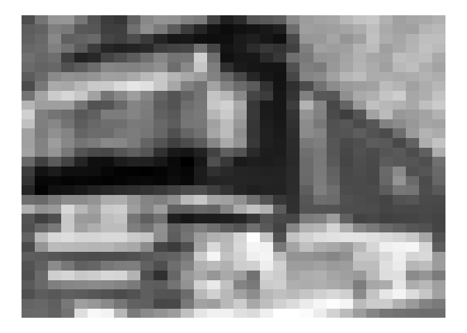

<!-- README.md is generated from README.Rmd. Please edit that file -->
extraclassical
==============

The R package 'extraclassical' allows for an analysis of extraclassical effects in images and is still under development. It may be installed using 'devtools':

``` r
# install.packages("devtools")
devtools::install_github("sflippl/extraclassical")
```

It provides an interface to the CIFAR-10 dataset (Krizhevsky 2009) using the function 'read\_cifar' and has the first batch of the dataset directly available for analysis:

``` r
cifar_10_1
#> # A tibble: 10,000 x 7
#>    filename              batch label red       green     blue      bw      
#>    <chr>                 <chr> <int> <list>    <list>    <list>    <list>  
#>  1 leptodactylus_pentad… 1         6 <dbl [32… <dbl [32… <dbl [32… <dbl [3…
#>  2 camion_s_000148.png   1         9 <dbl [32… <dbl [32… <dbl [32… <dbl [3…
#>  3 tipper_truck_s_00125… 1         9 <dbl [32… <dbl [32… <dbl [32… <dbl [3…
#>  4 american_elk_s_00152… 1         4 <dbl [32… <dbl [32… <dbl [32… <dbl [3…
#>  5 station_wagon_s_0002… 1         1 <dbl [32… <dbl [32… <dbl [32… <dbl [3…
#>  6 coupe_s_001735.png    1         1 <dbl [32… <dbl [32… <dbl [32… <dbl [3…
#>  7 cassowary_s_001300.p… 1         2 <dbl [32… <dbl [32… <dbl [32… <dbl [3…
#>  8 cow_pony_s_001168.png 1         7 <dbl [32… <dbl [32… <dbl [32… <dbl [3…
#>  9 sea_boat_s_001584.png 1         8 <dbl [32… <dbl [32… <dbl [32… <dbl [3…
#> 10 tabby_s_001355.png    1         3 <dbl [32… <dbl [32… <dbl [32… <dbl [3…
#> # … with 9,990 more rows
```

The column label contains the object category, which is irrelevant for the present purposes. The columns red, green, and blue contain the red, green, and blue channels of the image as a 32x32-matrix. The column bw contains a 32x32-matrix consisting of the values averaged over the red, green, and blue channels. The function 'matrix\_picture' displays the black-and-white picture represented by such a matrix:

``` r
matrix_picture(cifar_10_1$bw[[2]])
```



The function 'contrast\_filter' applies a contrast filter of a certain orientation (given by the corresponding compass point) and the function 'estimate\_contrast\_covariance' allows for the subsequent covariance estimation along this orientation (given by a choice of 'horizontal', 'vertical', 'diagonal', or 'antidiagonal'). For example, the following code yields the covariance along the horizontal contrast of the picture above:

``` r
cifar_10_1$bw[[2]] %>% 
    contrast_filter(orientation = "n") %>% 
    estimate_contrast_covariance(orientation = "horizontal")
#>  [1]  0.0568660502  0.0470976173  0.0355272345  0.0281842866  0.0222398575
#>  [6]  0.0174319250  0.0141939666  0.0117388015  0.0094433791  0.0081677667
#> [11]  0.0076007578  0.0081268686  0.0085564734  0.0081533715  0.0072663774
#> [16]  0.0059932098  0.0044113812  0.0022091795  0.0008749038  0.0005817948
#> [21]  0.0001987155 -0.0005687708 -0.0011228493 -0.0009225291 -0.0007508009
#> [26] -0.0005932494 -0.0005759180 -0.0002564241  0.0003528614  0.0003085433
```

References
----------

Krizhevsky, Alex. 2009. “Learning Multiple Layers of Features from Tiny Images.” doi:[10.1.1.222.9220](https://doi.org/10.1.1.222.9220).
